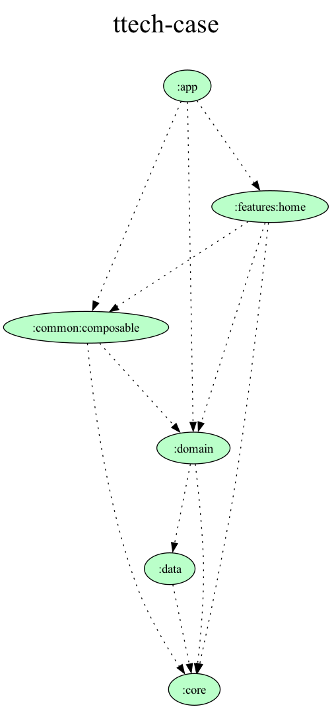
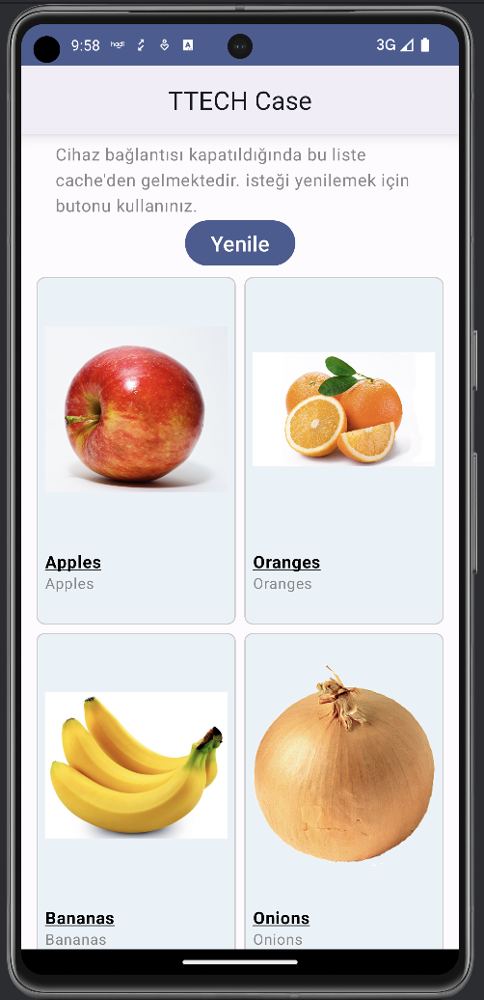
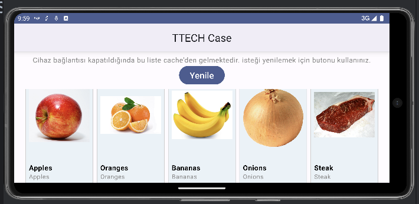
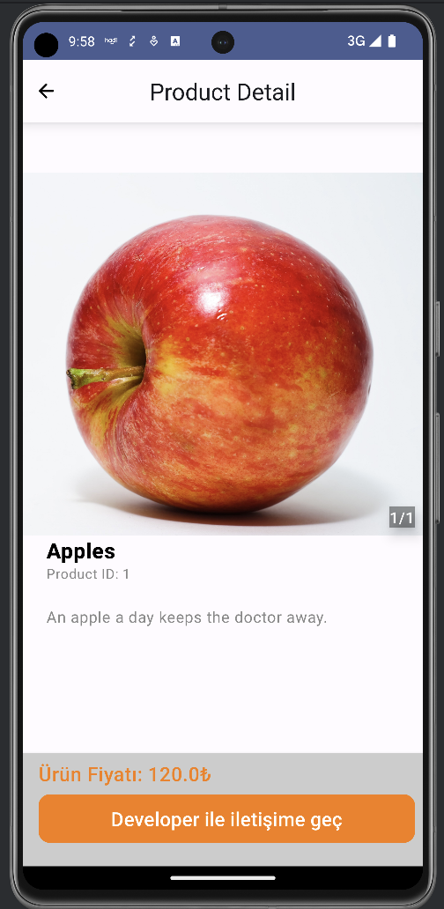

# YigitCanYilmaz
X Case Test

Unit test samples are availible under `:features:home` and `:domain` modules. Downloadable APK is available in *Releases* section.

Latest available package: [turkcell-case-release-v1.0.0](https://github.com/ycannot/turkcell-case/releases/tag/turkcell-case-release-v1.0.0)

## TechStack
* Jetpack Compose
* Coroutine
* Hilt
* Coil
* Multi Module
* Kotlin DSL
* Retrofit

## Architecture
* Clean Architecture
* MVI

## Modularization
This app consist of following modules:
* app
* feature
* common
* domain
* data
* core

## Preview

